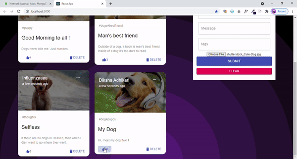

# MemoriesRelived
MERN stack web application called Puppygram!
It's a Place to add amazing and cute memories of your pets!
Technology stack used -> MongoDB, Express, React, Node

# Create

# Edit or Delete

cd server -> npm start
cd client -> npm start
